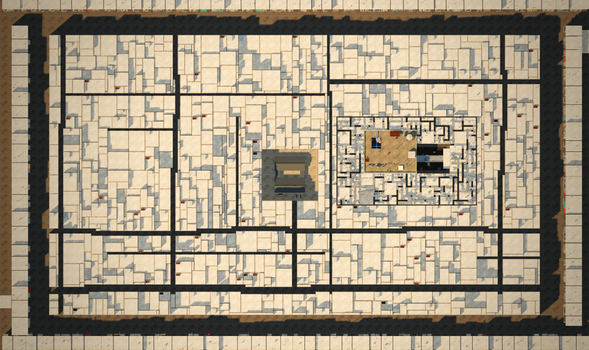

# Project Kowloon: State of the Game

*As of 28 September 2026. Godot build of the vertical slice "The Blue Pipe".*

Kowloon Walled City, 1992, in the last weeks before the clearance. Mei's grandfather needs his medicine taken to Mrs. Wong on the other side of the City. He gives Mei his old instant camera: *"You'll forget what things looked like."* The slice runs from his flat to Mrs. Wong's door and back, about fifteen minutes. It is complete and playable from the title screen to the ending.

---

## 1. At a glance

| | |
|---|---|
| Engine | Godot 4.7, Forward+ (Direct3D 12 on Windows) |
| Look | HD-2D: hand-pixelled characters on lit cards in a textured, lit 3D diorama, orthographic camera, tilt-shift and film grade |
| Length | About 15 minutes: 13 story stages, 52 conversations, 2 photographs for the scrapbook |
| Cast | 12 story and ambient residents, 10 background extras, Mei, pigeons; 28 sprite sheets in total, all authored in Aseprite |
| World | Three levels of Mei's building (Level A, Level B, the roof), an airshaft and a light well, inside a 210 × 120 m Walled City laid out from the 1985 survey map |
| Automated checks | Scripted playthrough from the first line to the ending: **PASS, 0 failures** |
| Performance (1080p, full quality) | 142–160 fps indoors, about 97 fps on the roof (the heaviest view) |
| Structure | Organised the same way as *Sporekeeper*: scenes hold nodes, `src/core/` holds code in layers (models, rules, nodes), one root coordinates components under `GameplayComponents`, no autoloads |

---

## 2. How to play

Open the project in Godot 4.7 and press Play. The main scene is the title screen.

| Key | Action |
|---|---|
| WASD / arrows | Move (relative to the camera) |
| Q / E | Turn the view 90° |
| F | Interact, talk, advance dialogue |
| Space | Advance dialogue, take a photo (it files itself into the album) |
| C | Raise or lower the camera (WASD frames the shot) |
| Tab | Open or close the scrapbook album; A / D or Q / E turn the pages |
| Esc | Close the camera or scrapbook; otherwise **pause** (Resume, volume, graphics, quit to title) |
| G | Graphics: full or fast |
| F1 or ` | Debug overlay (1–6 teleport, ] and [ step the story) |

---

## 3. The story as it plays

The slice follows the Three.js prototype's routes, puzzles and timing, plus the changes asked for since.

1. **Grandfather's flat (Level A).** Grandfather hands over the medicine and the camera. A near-wordless tutorial follows: the view turns once by itself, then key hints wait for the player to turn both ways (Q and E), then show WASD.
2. **The dead end.** The corridor stops at a wall. Turning the view reveals a service door (閒人免進) that can't be seen from the starting angle.
3. **Mr. Lau's clinic.** An unlicensed dentist packing up for the move. He asks for a photograph, and it goes into the scrapbook.
4. **Up to Level B.** Once Lau's photo is taken, the stairs open. The catwalk across the light well is blocked by wet washing.
5. **Mrs. Chan.** She is wringing out washing over her basin. Her son was meant to carry the sheets up to dry, and she sends Mei to find him on the roof.
6. **The airshaft puzzle.** The only way up is a rusted ladder whose bottom rungs have fallen away. An old crate is hidden behind a broken fridge and only shows when the view turns. Mei pushes it under the ladder and climbs, facing the ladder's wall.
7. **The roof.** Mei finds the Chan boy. Mr. Ng's lost pigeon is tucked in behind the water tank, so the player turns the view to find her and works out why she won't come down.
8. **Mr. Ng's photograph.** When he's framed in the viewfinder, a jet comes in low on the Kai Tak approach. The shutter waits ("Wait for it...") until the jet is in the picture.
9. **The washing moves.** The Chan boy unpins the sheets, carries them up through the stuck roof door and pegs them out on the roof line. His arms are empty once they're hung.
10. **Mrs. Wong.** With the catwalk clear, Mei delivers the medicine.
11. **Home.** Back at the flat, the packing boxes, and the ending card: *30 DAYS UNTIL WE LEAVE*.

Supporting systems: story stages with named teleports for debugging, a dialogue director with speaker "voice" blips, an interaction director with a single prompt, and small talk/look/use icons (pixelled in Aseprite) over whatever can be used.

---

## 4. Visual direction (HD-2D)

### Characters: pixel art in Aseprite

- Every character is built in **Aseprite** (via the aseprite MCP) from hand-authored part grids (`scripts/sprite_parts.py`). The catalog (`scripts/sprite_catalog.py`) assembles the frames. `tools/aseprite/build_characters.lua` does the palette swaps, selective outlines, compositing, layers and tags, and exports the sheets.
- The `.aseprite` files in `assets/sprites/aseprite/` are the editable source. They have layers (Legs, Body, Arms, Head, Hair, Prop), one tag per animation and view (`walk_side`, `work_back`, …) and per-frame timings.
- **Three views** (front, back, side, mirrored for the fourth) with idle, walk and talk, plus actions for each character:
  - Mei: camera, climb, reach, point.
  - Mrs. Chan: wringing washing.
  - Mr. Lau: his instrument tray.
  - Mr. Ng: feeding his pigeons, and holding one up.
  - Mr. Kwok: reading the paper.
  - The fan repairman: working with a screwdriver.
  - The Chan boy: carrying the bundle.
  - Grandfather: sitting.
  - Rooftop extras: laundry, birdcage, smoking, watering, pointing at planes.
- Rules held throughout: no jaggies, constant-width strokes in the side views (no notched knees), consistent proportions across the cast, and back views whose arms and props sit where they would really be.

### Environments: HD materials in a lit diorama

- A single world-space **triplanar surface shader** runs over an HD surface library, tinted per piece:
  - plaster, glazed tile, mosaic, terrazzo, timber;
  - board-formed concrete, bitumen;
  - rusted and painted metal, fabric;
  - tower-block facades with painted and lit windows.
- Lighting: warm bulbs, fluorescent tubes, golden-hour sun on the roof, SSAO/SSIL, glow and volumetric fog. The finish is a tilt-shift that starts soft and builds toward the edges, plus a film grade (amber highlights, teal shadows, grain, vignette).

### No clipping, and seeing through the City

- Character cards write the depth of a single anchor point, so a character is always wholly in front of a wall or wholly behind it, never sliced. A warm silhouette shows Mei through anything that hides her.
- **The cutaway:**
  - Floors above Mei's level are hidden.
  - Walls, doors and the Lau Dental signboard fade only where they stand between the camera and Mei.
  - Neighbouring rooms stay closed until Mei walks in; only a wall directly across the line to her gives way.
  - Mr. Kwok's stall never fades, so he is seen only when the view turns to its open front.

---

## 5. The Walled City, laid out from the 1985 map



*Top-down render of the game's City (north is up). Mei's detailed quarter is the lit block right of centre, the yamen's courtyard is at the centre, and the tenements line the boundary roads.*

The City fills the old fort's plot, **about 210 m east-west by 120 m north-south**. It is one mass of buildings grown into each other, capped at 13–14 storeys by the Kai Tak flight path into a rough plateau of roofs. The street network follows the Kowloon Walled City Kai Fong Association's 1985 map:

| Street | | Runs | Notes |
|---|---|---|---|
| Sai Shing Road | 西城路 | north–south | on the line of the old west wall |
| Tai Ching Street | 大井街 | north–south | named for the Big Well that once watered the City |
| Lo Yan Street | 老人街 | north–south | from Lung Chun Road up to the yamen |
| Kwong Ming Street | 光明街 | north–south | west of Mei's building |
| Lung Shing Road | 龍城路 | north–south | parallel to Tung Tsing Road; its north mouth faces Tung Tau Tsuen Road |
| Yi Hok Lane | 義學巷 | north–south | a lane in the west half |
| Lung Chun Road | 龍津道 | east–west | laid in 1951 along the base of the old south wall |
| Lung Chun Street | 龍津路 | east–west | the ancient street on the line of the gates, with its back street 龍津後街 |
| Tin Hau Temple Street, She Kung Street | 天后廟街, 社公街 | east–west | in the north |
| Cheung On Lane, Cheung Hing Lane | 長安里, 長興里 | east–west | small lanes |

- **The alleys** are 1.2–3.5 m wide and jog as they go, as rebuilt buildings pushed their lines about. The narrow ones stay dark slots between the buildings, as they were.
- **The yamen** (衙門), the 1847 magistrate's office and by then an old people's home, sits at the centre: two grey-brick halls under grey tile, joined by side corridors round a court. There are old cannons and residents sitting out, in the one open space where sunlight reached the ground.
- **Boundary roads**, with Kowloon City's tenements facing the City across them, each balcony different:
  - Tung Tau Tsuen Road (north), its frontage crowded with the boards of unlicensed dentists;
  - Tung Tsing Road (east);
  - Carpenter Road (south);
  - Sai Tau Tsuen Road (west).
- **Beyond:** the hills and Lion Rock to the north, and the red-and-white checkerboard hill to the west where the jets turned in. To the south-east are Kowloon Bay and Kai Tak's runway.
- **Mei's building** stands east of the yamen, between Kwong Ming Street and Lung Shing Road. Its surroundings are built in full detail, floor by floor. The rest of the City is built for the view from the roof, with the same materials and 3D cages, air conditioners, laundry poles, aerials, water tanks, huts, pigeon lofts and washing. It is merged and instanced, so the whole plot costs little to draw.

*Source for the street names and layout: the Walled City's 1985 Kai Fong Association map as documented on Chinese Wikipedia (九龍寨城); dimensions and the height limit from English Wikipedia. The exact shapes of individual buildings are not from a survey. The plot, streets, yamen and boundary roads are placed to the map, and the buildings between them are generated.*

---

## 6. Sound

- Ambient beds cross-fade with the light: the building's hum inside, wind and far traffic on the roof.
- Places are heard before they are seen: Grandfather's radio, the TV, the dental drill (now a low, quiet hum), mahjong tiles, the chopping block, drips, pigeons, children on the roofs.
- Voices are speaker-pitched blips.
- One-shots: the shutter, the camera, footsteps, creaks, the jet.
- A master volume slider in the pause menu, remembered between sessions.

All audio is generated by `scripts/make_audio.py`.

---

## 7. Interface

- **Title screen:** the rooftops behind a seal-style title.
- **HUD:** the current objective with the pipe-blue rule, hints, notices, and the interaction icon.
- **Dialogue box:** a speaker plate and advance prompt.
- **Camera:**
  - The viewfinder turns yellow when a photographable subject is framed.
  - The Polaroid develops over a few seconds, then goes into the album by itself.
  - **The scrapbook** is a cloth-bound 1990s photo album with a gold-foil cover and Mei's name label.
    - It rises into view shut, the cover swings open in perspective, and the pages turn one leaf at a time with A / D, Q / E or a click. Closing folds everything back under the cover.
    - Each turning leaf is drawn by one shader (`page_leaf.gdshader`) from textures of the pages.
    - A new photograph is filed while you watch: the Polaroid hangs over the table while the album opens to its page, then drops into place, is taped down at both corners, and Mei's notes are written in beside it. The name, details and her note are in pen, and the history is in grey pencil.
    - The first spread is a handwritten title page. There is one person per page, so it grows as the game does.
- **Pause menu (Esc):** Resume, volume, graphics, quit to title.
- **Ending screen**, and a **debug overlay** for stages and teleports.

---

## 8. How it is built

```
scenes/app/            title screen (main scene)
scenes/slice/          slice.tscn (SliceRoot) and the baked level.tscn
scenes/ui/             hud, dialogue, photo, scrapbook, menus (ending, pause), debug
src/core/models/       quest stages, dialogue catalog, residents, sprite sheets, level data, surfaces
src/core/rules/        walk space (collision), view maths, perspective rules
src/core/nodes/        slice root and settings, world, player, camera, characters, quests,
                       dialogue, interaction, photography, scrapbook, audio, ui
tools/level/           the level bake: interiors, the 1985 Walled City, tenements and horizon
tools/scenes/          scene and theme builder
tools/aseprite/        character build scripts (run inside Aseprite)
tools/capture/         screenshots, the top-down plan, occlusion probe
scripts/               texture, prop, audio and sprite-catalog generators
tests/                 integration playthrough, performance probe
```

- The level is **baked** (`tools/level/bake_level.gd`) into `scenes/slice/level.tscn` and `data/level/level_data.tres`. The bake covers floors, obstacles, story references, climb paths and every piece tagged for the cutaway.
- Scenes and the UI theme are **generated** (`tools/scenes/build_scenes.gd`), so every exported reference is wired.
- Each frame, the world re-checks only the pieces that can change: those that fade, move, or belong to a room. The static city is re-checked when Mei changes level and otherwise a slice per frame. This is what keeps the roof above 95 fps with the full City in view.

---

## 9. What has been done, in order

| Commit | Work |
|---|---|
| `7a8355d` | Design guide, the Three.js prototype, a Godot shell |
| `9e774f7` | HD-2D foundation: Aseprite character pipeline, HD surface library, level bake |
| `28a7bbb` | Playable slice: every system, UI, audio, the automated playthrough |
| `9d11812` | Aseprite plants, photo-studio viewpoint, title backdrop, docs |
| `5f371a6` | Feedback round 1: the crate-and-ladder puzzle, the jet timed to Mr. Ng's photo, interaction icons, the perspective tutorial, readable stairwell, visible service door, rooms revealed only on entry, Mr. Kwok hidden until the view turns, softer drill and tilt-shift, washing that swings instead of sliding |
| `a55de0d` | Feedback round 2: pause menu with volume, Mrs. Chan wringing washing, the Chan boy's sheets hung clear of the neighbours', Mei climbing the ladder on its wall |
| this round | The City laid out from the 1985 map; the Lau Dental sign no longer hides Mei in the doorway; the Chan boy's arms empty once the sheets are hung; per-frame world cost cut, from about 75 to about 150 fps indoors |

---

## 10. Known limitations and next steps

- **The camera never sees most of the City's layout.** The zoomed diorama camera shows the surrounding blocks and nearby alleys from the roof. The yamen and the far streets are there, and are drawn cheaply, but are rarely in frame. A viewpoint on the roof, or an establishing shot on the title, would show them off.
- **Building footprints are generated** between the mapped streets, not traced from the survey.
- **The roof cutaway:** while Mei climbs the airshaft, the Chan boy on the roof can appear above the shaft with the roof floor in front of him cut away.
- **Content:** this is one vertical slice. The wider game (more families, the clearance timeline, other districts of the City) is designed in the guide but not built.
- **Platform:** tested on Windows with Direct3D 12 only.
